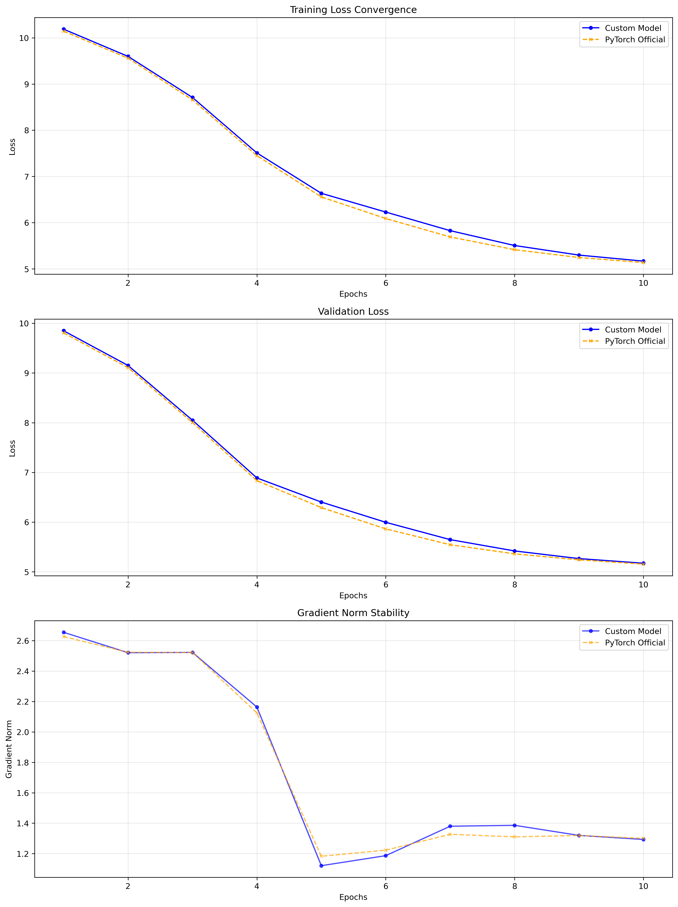
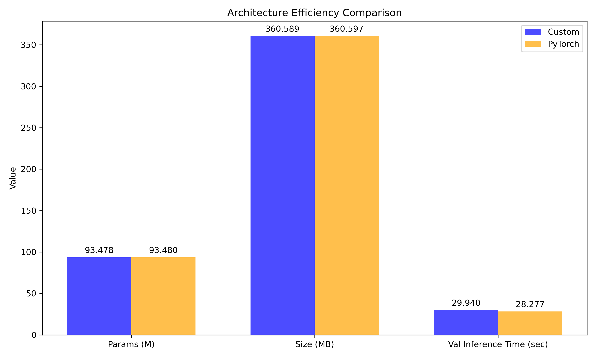

# Transformer Architecture Reimplementation From Scratch

A clean, modular and well-tested reimplementation of the Transformer architecture from **"Attention Is All You Need"** (Vaswani et al., 2017) from scratch.

Built to gain a deeper understanding of sequence modeling, attention mechanisms, and the end-to-end training pipeline behind modern language models.

## 🎯 Motivation 

Transformers power today’s most advanced language models. Rebuilding one from the ground up provides clarity on:

- how attention scores are computed and normalized
- how information flows through encoder–decoder layers
- how masking and batching affect training stability
- how model components interact to form a complete architecture
- what optimizations matter in a practical training pipeline

## ✨ Features

### 🧠 Core Transformer Components (Implemented From Scratch)
- Scaled Dot-Product Attention  
- Multi-Head Attention  
- Position-wise Feed-Forward Networks  
- Sinusoidal Positional Encoding  
- Residual connections + LayerNorm  
- Fully Functional Encoder–Decoder Transformer model

### ⚙️ Custom Training Pipeline
- Mixed Precision (AMP)  
- Gradient Accumulation  
- Learning Rate Scheduler
- Gradient Clipping
- Early Stopping  
- Architecture and Training Comparison

### 📚 Dataset Training
- The dataset used was the Multi30k dataset from HuggingFace, which consists of English sentences and their German translations. 
- Due to local computational constraints, the model was trained on a 5,000 sample subset of Multi30k out of which 75% were chosen for training and 25% for validation. 
- The objective of this training run was to verify the mathematical convergence, gradient flow, and architectural parity with PyTorch. 
- Dataloader with padding and batching

### 🧪 Testing Support
- Unit tests for attention, masking, model forward passes and gradient flow verification.
- Easy to extend for additional coverage.

### 🛠️ Tech Stack
- Python, PyTorch, NumPy, Matplotlib, Datasets, Transformers, PyTest.

## 📊 Architecture Validation & Comparison
To verify the mathematical and structural accuracy of the custom implementation, the model was benchmarked against the official **torch.nn.Transformer** module using identical hyperparameters. Because the official PyTorch module does not include a built-in positional encoding layer, the custom sinusoidal positional encoding module was used for both models to ensure a fair comparison.

### Training Dynamics:

- **Loss Convergence**: Both models exhibit virtually overlapping training and validation loss curves, converging identically from a loss of ~10.0 down to ~5.1 over 10 epochs.

- **Gradient Stability**: Gradient norms track almost identically, confirming the custom masking and attention logic maintains healthy gradient flow without exploding or vanishing gradient problems.



### Efficiency Metrics:

- **Parameter Count**: Virtually identical capacity (~93.478M custom vs. ~93.480M official).

- **Memory Footprint**: Extremely similar size (~360.589 MB custom vs. ~360.597 MB official).

- **Inference Speed**: The official PyTorch implementation yields a marginal ~5.5% speedup during validation (28.2s vs 29.9s) for 1,250 samples. This slight speed advantage is completely expected because PyTorch uses heavily optimized, low-level C++ code under the hood.



## 📁 Repository Structure

```
├── experiments/                     # Training artifacts, weights, and comparison metrics
├── src/
│   └── transformer_architecture/
│       ├── common/                  # Shared utilities (e.g., masking, positional encoding)
│       ├── comparison/              # Evaluation and visualization scripts
│       ├── custom_implementation/   # Core Transformer architecture built from scratch
│       ├── data/                    # Dataset loading and preprocessing pipeline
│       ├── pytorch_official_module/ # PyTorch baseline wrapper
│       ├── training/                # Training loop, logging, and optimization logic
│       └── main.py                  # Entry point for the execution pipeline
├── tests/                           # PyTest suite for module verification
├── config.yaml                      # Hyperparameter configuration
├── requirements.txt                 # Project dependencies
├── setup.py                         # Package installation configuration
└── README.md                        # Project documentation
```

## 🚀 Getting Started

### Installation

```bash
conda create --name <env_name>
conda activate <env_name>
pip install -r requirements.txt
```

```bash
pip install -e .
```

### Training
```bash
python src/transformer_architecture/main.py
```

### Modify Hyperparameters
Edit:

```
config.yaml
```

## 📖 Learnings 

- Tensor operations behind attention  
- Construction and scaling of multi-head attention  
- Why positional encodings are necessary  
- Interaction between encoder and decoder during training 
- How to build a robust training loop from scratch  
- Masking, padding, and batching in sequence models 
- How to structure a production-grade deep learning project

## 🧩 Possible Extensions 

- Beam Search Decoding 
- Top-k and Nucleus (Top-p) sampling strategies
- Gradient Checkpointing for Memory Efficiency 
- Add BLEU / ROUGE metrics & logging dashboards  
